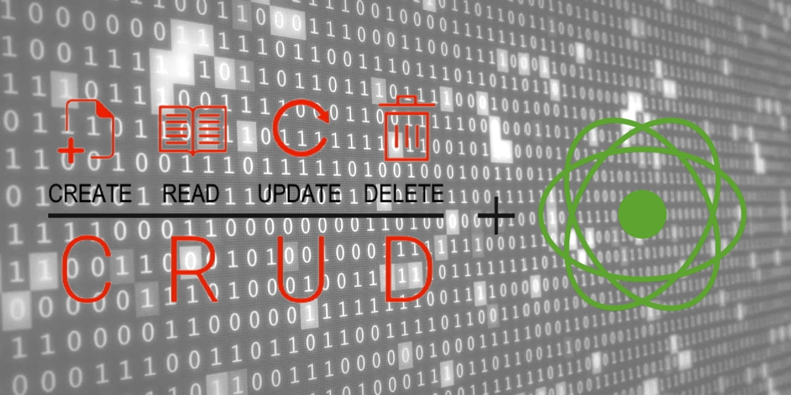
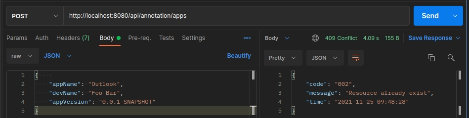

# Spring Boot WebFlux CRUD Application 



# Introduction

## Overview
**Spring WebFlux** was released in the Spring Framework 5.0 as a reactive-stack non-blocking web framework alternative to Spring MVC. It was designed to support fully non-blocking reactive streams with <ins>back-pressure</ins><a href="#note1" id="note1ref"><sup>1</sup></a> capability, levearaging multi-core and next-generation processors on handling massive numbers of concurrent connections with a small number of threads and able to scale with fewer hardware resources. Spring WebFlux is built on top of the [Project Reactor](https://github.com/reactor/reactor) library, according to specified on the [Reactive Streams Specification](https://www.reactive-streams.org/) and runs on servers like [Netty](https://netty.io/) (default), [Undertow](https://undertow.io/) and also on Servlet 3.1+ containers.


## Reactive Programming
Reactive programming is a programming standard that is built around an asynchronous, non-blocking, event-oriented approach on dealing with data stream. It involves modeling data and events as observable data streams and implementing data processing flows to react upon changes in those streams. With **Spring WebFlux** we can define web server components in two ways: via annotations, like with Spring MVC, or through the new functional lambda-based style where the components are declared via functions.


## Reactive API
**Spring WebFlux** uses two API types of <ins>publishers</ins><a href="#note2" id="note2ref"><sup>2</sup></a> to work on data sequences, [Mono](https://projectreactor.io/docs/core/release/api/reactor/core/publisher/Mono.html) and [Flux](https://projectreactor.io/docs/core/release/api/reactor/core/publisher/Flux.html):
* `Mono` is used for handling sequences of 0 or 1 element
  ```java
  Mono<Long> mono = Mono.just(1);
  Mono<String> mono = Mono.just("Foo");
  Mono<String> mono = Mono.empty();
  ```

* `Flux` is used for handling sequences of 0 to N elements
  ```java
  Flux<String> flux = Flux.just("Java", "Foo", "Bar");
  Flux<Long> flux = Flux.fromArray(new Long[]{1, 2, 3});
  Flux<String> flux = Flux.fromIterable(Arrays.asList("A", "B", "C"));
  ```

  ### Data Stream Classification
  Reactive programming is all about working with data streams and there are two categories to consider: Cold Stream and Hot Streams. This distinction mainly has to do with how the reactive stream reacts to subscribers.

  * **Cold Streams** are lazy (i.e. pull based) streams, formed by a set of pre-defined data waiting for subscribers. Once the subscriber is registered, the cold stream starts to emit the data. An example would be streaming of movies from plataforms like Netflix that occurs only upon user requests.

  * **Hot streams** are active streams (i.e. push based), which are waiting for data to be sent to registered subscribers. As soon as the subscriber is related to the hot stream it starts to react to the data. An example would be an one-click listener on user interfaces (UI).


## Spring WebFlux or Spring MVC?
Spring MVC is built on the Servlet API and uses a synchronous blocking I/O approach with a one-request-per-thread model. The choice between one over the other will depend on the needs and particularities of the project. For instance, if you already have a Spring MVC application that is working fine, there is no need to adapt it to be reactive since imperative programming is historycally easiest to write, understand, maintain and debug. Also, we have a large choice of libraries that is mostly blocking. On the other hand you can be benefited on chosing the reactive way for simple applications or microservices that have less complex requirements by taking advantage of the lightweight and functional programming style, powered by Java lambdas, which fits very well when comes to write code reactively.

The following diagram provides a comparing overview between Spring WebFlux and Spring MVC.


## Reactive Database
The [R2DBC](https://r2dbc.io/) project brought us reactive programming interface to relational databases, which Spring Data relies on it to support reactive database connectivity.
### Database Initialization
By default, in non-reactive Spring Boot application, we leverage `schema.sql` and `data.sql` files for setting up an initial schema and populating it with some data. However, when working with Spring Data R2DBC, we have to take an extra step to set a schema and get it initialized with data dinamically as follows:
  - schema.sql
    ```sql
    CREATE TABLE app (
      id INTEGER NOT NULL AUTO_INCREMENT,
      name VARCHAR(255) NOT NULL,
      author VARCHAR(255) NOT NULL,
      version VARCHAR(255) NOT NULL,
      PRIMARY KEY (id)
    );
    ```
  - data.sql
    ```sql
    INSERT INTO app (id, name, author, version) VALUES (1, 'Netflix', 'Foo Bar', '0.0.1-SNAPSHOT');
    INSERT INTO app (id, name, author, version) VALUES (2, 'Facebook', 'Foo Bar', '0.0.1-SNAPSHOT');
    INSERT INTO app (id, name, author, version) VALUES (3, 'Chrome', 'Foo Bar', '0.0.1-SNAPSHOT');
    ```
  - Java bean
    ```java
    @Bean
    public ConnectionFactoryInitializer databaseInitializer(ConnectionFactory connectionFactory) {
        ConnectionFactoryInitializer initializer = new ConnectionFactoryInitializer();
        initializer.setConnectionFactory(connectionFactory);
  
        CompositeDatabasePopulator populator = new CompositeDatabasePopulator();
        populator.addPopulators(new ResourceDatabasePopulator(new ClassPathResource("schema/schema.sql")));
        populator.addPopulators(new ResourceDatabasePopulator(new ClassPathResource("schema/data.sql")));
        initializer.setDatabasePopulator(populator);
        return initializer;
    }
    ```


## Reactive REST Application
**Spring WebFlux** supports two programming models:

- Annotation-based
   * Publishing a single resource by using a `Mono` since we want to return at most one element:
   ```java
   @GetMapping("{id}")
   public Mono<ClientDTO> getClientById(@PathVariable String id) {
      return clientService.findById(id);
   }
   ```
   * Publishing a collection of resources by returning a `Flux` since we want to return 0 or N elements:
   ```java
   @GetMapping("{id}")
   public Flux<ClientDTO> getAllClient() {
      return clientService.findAll();
   }
   ```

- Functional-based
   * Exposing a route for returning a single resource:
   ```java
   @Bean
   public RouterFunction<ServerResponse> getClientById() {
      return route(GET("/clients/{id}"), 
         req -> ok().body(clientService.findById(req.pathVariable("id")), ClientDTO.class));
   }   
   ```
   * Exposing a route for returning a collection of resources:
   ```java
   @Bean
   public RouterFunction<ServerResponse> getClientById() {
      return route(GET("/clients"), 
         req -> ok().body(clientService.findAll(), ClientDTO.class));
   } 
   ```

  ⚠️ In this sample project, I'm implementing on both ways in order to demonstrate the power and simplicity of functional programming, as most of us are already used to the annotation style from Spring MVC.


  ### Exception Handling
  When working with Spring MVC application, `@ControllerAdvice` along with `@ExceptionHandler` provide us a way to unify and centralize exception handling across the whole application, what benefits in the reduction of code duplication and in building cleaner code. With Spring WebFlux-powered applications it wouldn't be different! 
  
  Unfortunately `@ControllerAdvice` does not catch exceptions that happen from requests targeted to reactive routes. For this reason I implemented for both endpoint types (i.e. annotation-based and functional-route-based) global exception handling that can be checked on [GlobalWebMVCExceptionHandler](src/main/java/io/davidarchanjo/code/exception/GlobalWebMVCExceptionHandler.java) and [GlobalWebFluxExceptionHandler](src/main/java/io/davidarchanjo/code/exception/GlobalWebFluxExceptionHandler.java) classes respectively.  


# Prerequisites
- Maven 3+
- JDK 17
- Coffee ☕ 


# Libraries and Dependencies
- [Spring WebFlux](https://docs.spring.io/spring-framework/docs/current/reference/html/web-reactive.html)
- [Spring Data R2DBC](https://spring.io/projects/spring-data-r2dbc)
- [Spring DevTools](https://docs.spring.io/spring-boot/docs/current/reference/html/using.html#using.devtools)
- [R2DBC-H2](https://github.com/r2dbc/r2dbc-h2)
- [H2 Database](https://www.h2database.com/html/main.html)
- [Lombok](https://projectlombok.org/)
- [Model Mapper](http://modelmapper.org/)


# Project Structure
Follows the base folders, i.e. packages, in which the project is organized and the purpose of each:
- [📁 application](src/main/java/io/davidarchanjo/code/application): contains the main class annotated with:
   * `@EntityScan` which indicates the package location of Entity classes;
   * `@SpringBootApplication` which indicates the source class to bootstrap and launch the Spring Boot application;
   * `@EnableR2dbcRepositories` which activates reactive relational repositories using R2DBC and points out the package location of R2DBC repository interface definitions
- [📁 builder](src/main/java/io/davidarchanjo/code/builder): contains utility component class responsible for converting Entity to DTO and vice-versa;
- [📁 config](src/main/java/io/davidarchanjo/code/config): contain definition of beans through configuration classes annotated with `@Configuration`;
- [📁 controller](src/main/java/io/davidarchanjo/code/controller): contains class annotated with `@RestController` which is where HTTP request handler methods are defined and implemented;
- [📁 exception](src/main/java/io/davidarchanjo/code/exception): contain custom exceptions for handling specific data consistent and/or business rule violations; also contain class annotated with `@ControllerAdvice` to centralize exception handling across the whole application
- [📁 handler](src/main/java/io/davidarchanjo/code/handler): contains a component class where are implemented handler methods for HTTP requests, in which the requests are directed to the specified business service interface;
- [📁 domain](src/main/java/io/davidarchanjo/code/model/domain): contain POJO classes representing database entities i.e., classes mapping database tables;
- [📁 dto](src/main/java/io/davidarchanjo/code/model/dto): contain DTO classes which are used as objects that pass through architectural boundaries to transfer data;
- [📁 repository](src/main/java/io/davidarchanjo/code/repository): contains a class annotated with `@ReactiveCrudRepository` responsible for providing the mechanism for storage, retrieval, search, update and delete operation of data against a database in a rective way;
- [📁 router](src/main/java/io/davidarchanjo/code/router): contains a configuration class where are exposed through a `@Bean` method all the HTTP routes;
- [📁 service](src/main/java/io/davidarchanjo/code/service): contains a class annotated with `@Service` in which business logic is implemented;


# Booting Up
For simplicity's sake, I prefer to use the command line when trying something new, but you can google on how to set up a maven project in your favorite IDE. 😉
<ol>
<li>Clone the repository:</li>
  <code>git clone https://github.com/davidarchanjo/spring-boot-reactive-crud-rest</code>
<li>Navigate to the folder:</li>
  <code>cd spring-boot-reactive-crud-rest</code>
<li>Install dependencies and build the application:</li>
  <code>mvn clean install</code>
<li>Run the application:</li>
  <code>java --enable-preview -jar target/spring-boot-crud-rest-reactive-1.0.0.jar</code>
</ol>

**NOTE**: The `--enable-preview` flag is been used to unlock preview features on the JVM because I'm using the _new <ins>switch expression</ins><a href="#note3" id="note3ref"><sup>3</sup></a> with arrow label_ as part of the implementation of the [GlobalWebFluxExceptionHandler](src/main/java/io/davidarchanjo/code/exception/GlobalWebFluxExceptionHandler.java).


## Maven Configuration
I needed to do some extra settings in my environment so that maven could be able to compile the project, something that is directly related to be using Java 17 with preview features on. If you're using only IDE for coding, such as Intellij, probably you won't need to bother with that.

So the first thing to do is create a file called `.mavenrc` in the root of your home folder, if it doesn't exist, and add these two lines:
```bash
export JAVA_HOME="/home/david_pereira/.jdks/openjdk-17.0.1"
export MAVEN_OPTS="--add-opens java.base/java.lang=ALL-UNNAMED"
```
👀 _You'll have to adjust the `JAVA_HOME` to reflect the exact path where it is installed in your environment._ 

After edit and save the `.mavenrc` file, execute the following:
```bash
$ source ~/.mavenrc 
```

To confirm everything that was configured is working properly, execute the following command:
```bash
$ mvn -version
```

Your output should be similar to the following screenshot:


# Testing
1. Get All Apps
- HTTP Method: GET
- URL: http://localhost:8080/api/functional/apps or http://localhost:8080/api/annotation/apps
- Response Body:
  ````json
  [
    {
        "id": 1,
        "appName": "Netflix",
        "devName": "Foo Bar",
        "appVersion": "0.0.1-SNAPSHOT"
    },
    {
        "id": 2,
        "appName": "Facebook",
        "devName": "Foo Bar",
        "appVersion": "0.0.1-SNAPSHOT"
    },
    {
        "id": 3,
        "appName": "Chrome",
        "devName": "Foo Bar",
        "appVersion": "0.0.1-SNAPSHOT"
    }
  ]
  ````
  **NOTE:** According to what was set through [data.sql](src/main/resources/schema/data.sql), the application should start with the database populated with three applications.

2. Get App By Id
- HTTP Method: GET
- URL: http://localhost:8080/api/functional/apps/{id} or http://localhost:8080/api/annotation/apps/{id}
- Response Body:
  ````json
  {
    "appName": "Netflix",
    "devName": "Foo Bar",
    "appVersion": "0.0.1-SNAPSHOT"
  }
  ````

2. Create New App
- HTTP Method: POST
- URL: http://localhost:8080/api/functional/apps or http://localhost:8080/api/annotation/apps
- Request Body:
  ````json
  {
    "appName": "Outlook",
    "devName": "David Archanjo",
    "appVersion": "1.0.0"
  }
  ````

3. Update App
- HTTP Method: PUT
- URL: http://localhost:8080/api/functional/apps/{id} or http://localhost:8080/api/annotation/apps/{id}
- Request Body:
  ````json
  {
    "appName": "Netflix",
    "devName": "David Archanjo",
    "appVersion": "1.0.0"
  }
  ```` 
 
4. Delete App
- HTTP Method: DELETE
- URL: http://localhost:8080/api/functional/apps/{id} or http://localhost:8080/api/annotation/apps/{id}


## Exception Handling
1. Trying To Access Deleted App
  

1. Trying To Create Duplicated App 
  


# Conclusion
The resources for implementing Reactive Restful APIs using Spring Boot are almost infinite and up-to-date with what is most advanced for building Java-based systems with scalability and intelligent use of computational resources in mind, thanks to initiatives like [Project Reactor](https://projectreactor.io/) and [RxJava](https://github.com/ReactiveX/RxJava). In this project my objectives were to highlight the main characteristics of the reactive programming usage focused on the different ways of defining endpoints, via annotations and by function routes, as well as demonstrate the power and simplicity on how data can be manipulated reactively in contrast on how we are used to doing in the "old-school way" with Spring MVC.


# References
<a id="note1" href="#note1ref"><sup>1</sup></a> <ins>back-pressure</ins> - mechanism that allows the sender to control the rate of consumption of the data stream so that the subscriber is not overloaded.

<a id="note2" href="#note2ref"><sup>2</sup></a> <ins>publisher</ins> - stream provider of a potentially unbounded number of sequenced elements, publishing them according to the demand received from its subscriber(s).

<a id="note3" href="#note3ref"><sup>3</sup></a> <ins>switch expression</ins> - check [here](https://www.infoq.com/articles/java-12-switch-expression/) for more details.
